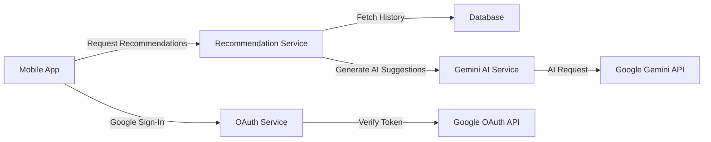

# Google Gemini AI Integration Guide

This guide explains how to integrate Google Gemini AI into the ZMOS backend alongside your existing Google OAuth authentication.

## Overview

You're already using Google services for:
- ✅ **Google OAuth** - User authentication (Sign-in with Google)

Now adding:
- 🆕 **Google Gemini AI** - AI-powered session recommendations

Both services work together seamlessly with separate API keys.

---

## Setup Instructions

### Step 1: Get Google AI API Key

1. **Visit Google AI Studio**: https://aistudio.google.com/app/apikey

2. **Sign in** with your Google account (same account you used for OAuth is fine)

3. **Click "Create API Key"**
   - Choose "Create API key in new project" OR
   - Select an existing Google Cloud project

4. **Copy your API key** - It looks like: `AIzaSyC...`

5. **Keep it secure** - This key is different from your OAuth Client ID

### Step 2: Add API Key to Environment Variables

Update your `.env` file:

```env
# Existing Google OAuth configuration
GOOGLE_CLIENT_ID="878292483430-qppqcfrlvigt1269tbik2tr8i5a0n6c9.apps.googleusercontent.com"

# NEW: Google AI (Gemini) configuration
GOOGLE_AI_API_KEY="AIzaSyC_your_actual_api_key_here"
```

### Step 3: Install Google AI SDK

```bash
npm install @google/generative-ai
```

### Step 4: Verify Installation

```bash
npm list @google/generative-ai
```

Expected output:
```
zmos-backend@0.0.1 /home/turnkey/zmos-backend
└── @google/generative-ai@0.x.x
```

---

## Implementation

### File Structure

Create the following new files:

```
src/
├── ai/
│   ├── ai.module.ts           # AI module configuration
│   ├── ai.service.ts          # Gemini AI service
│   └── dto/
│       └── recommendation.dto.ts  # Request/response DTOs
└── moveos/
    └── controllers/
        └── recommendation.controller.ts  # API endpoints
```

### 1. Create AI Module

**File**: `src/ai/ai.module.ts`

```typescript
import { Module } from '@nestjs/common';
import { ConfigModule } from '@nestjs/config';
import { AiService } from './ai.service';

@Module({
  imports: [ConfigModule],
  providers: [AiService],
  exports: [AiService],
})
export class AiModule {}
```

### 2. Create AI Service

**File**: `src/ai/ai.service.ts`

```typescript
import { Injectable, Logger } from '@nestjs/common';
import { ConfigService } from '@nestjs/config';
import { GoogleGenerativeAI } from '@google/generative-ai';

@Injectable()
export class AiService {
  private readonly logger = new Logger(AiService.name);
  private genAI: GoogleGenerativeAI;
  private model;

  constructor(private configService: ConfigService) {
    const apiKey = this.configService.get<string>('GOOGLE_AI_API_KEY');

    if (!apiKey) {
      this.logger.warn('GOOGLE_AI_API_KEY not found. AI features will be disabled.');
      return;
    }

    this.genAI = new GoogleGenerativeAI(apiKey);
    this.model = this.genAI.getGenerativeModel({
      model: 'gemini-1.5-flash',  // Free tier model
    });

    this.logger.log('Google Gemini AI initialized successfully');
  }

  /**
   * Generate session recommendations based on member's history
   */
  async generateSessionRecommendations(memberHistory: {
    attendedSessions: Array<{
      sessionType: string;
      category: string;
      difficulty: string;
      date: Date;
    }>;
    favoriteCategories?: string[];
    currentStreak?: number;
  }): Promise<{
    recommendations: Array<{
      category: string;
      difficulty: string;
      reason: string;
    }>;
    confidence: number;
  }> {
    if (!this.model) {
      throw new Error('AI service not initialized. Check GOOGLE_AI_API_KEY.');
    }

    try {
      const prompt = this.buildRecommendationPrompt(memberHistory);

      this.logger.debug('Sending prompt to Gemini AI');
      const result = await this.model.generateContent(prompt);
      const response = await result.response;
      const text = response.text();

      this.logger.debug('Received response from Gemini AI');

      // Parse AI response into structured format
      return this.parseRecommendations(text);
    } catch (error) {
      this.logger.error('Error generating recommendations:', error);

      // Fallback to rule-based recommendations
      return this.getFallbackRecommendations(memberHistory);
    }
  }

  /**
   * Build a structured prompt for the AI
   */
  private buildRecommendationPrompt(memberHistory: any): string {
    const recentSessions = memberHistory.attendedSessions
      .slice(-10)
      .map(s => `${s.sessionType} (${s.category}, ${s.difficulty})`)
      .join(', ');

    const favoriteCategories = memberHistory.favoriteCategories?.join(', ') || 'None';

    return `You are a fitness recommendation AI for a gym management system.

Member's Recent Activity:
- Recent Sessions: ${recentSessions || 'No recent sessions'}
- Favorite Categories: ${favoriteCategories}
- Current Streak: ${memberHistory.currentStreak || 0} days

Available Session Categories:
1. HIIT (High-Intensity Interval Training) - Difficulty: beginner, intermediate, advanced
2. Yoga - Difficulty: beginner, intermediate, advanced
3. Strength Training - Difficulty: beginner, intermediate, advanced
4. Cardio - Difficulty: beginner, intermediate, advanced
5. Pilates - Difficulty: beginner, intermediate, advanced

Task: Recommend 3 session types that would be beneficial for this member.

Output Format (JSON only, no markdown):
{
  "recommendations": [
    {
      "category": "HIIT",
      "difficulty": "intermediate",
      "reason": "Based on your consistent attendance in cardio sessions, HIIT will help improve cardiovascular endurance"
    }
  ],
  "confidence": 0.85
}

Important:
- Consider progression (gradually increase difficulty)
- Ensure variety (don't recommend same category repeatedly)
- Match difficulty to their experience level
- Provide specific, personalized reasons`;
  }

  /**
   * Parse AI response into structured recommendations
   */
  private parseRecommendations(text: string): any {
    try {
      // Remove markdown code blocks if present
      const cleaned = text
        .replace(/```json\n?/g, '')
        .replace(/```\n?/g, '')
        .trim();

      const parsed = JSON.parse(cleaned);

      // Validate structure
      if (!parsed.recommendations || !Array.isArray(parsed.recommendations)) {
        throw new Error('Invalid response structure');
      }

      return parsed;
    } catch (error) {
      this.logger.error('Failed to parse AI response:', error);
      throw new Error('Failed to parse AI recommendations');
    }
  }

  /**
   * Fallback to rule-based recommendations if AI fails
   */
  private getFallbackRecommendations(memberHistory: any): any {
    this.logger.warn('Using fallback rule-based recommendations');

    const recommendations = [];

    // Simple rule: If user did HIIT, suggest Yoga for recovery
    if (memberHistory.attendedSessions.some(s => s.category === 'HIIT')) {
      recommendations.push({
        category: 'Yoga',
        difficulty: 'beginner',
        reason: 'Great for recovery and flexibility after high-intensity workouts',
      });
    }

    // Rule: Always suggest strength training
    recommendations.push({
      category: 'Strength Training',
      difficulty: 'intermediate',
      reason: 'Essential for building muscle and overall fitness',
    });

    // Rule: Variety with cardio
    recommendations.push({
      category: 'Cardio',
      difficulty: 'intermediate',
      reason: 'Maintain cardiovascular health and endurance',
    });

    return {
      recommendations: recommendations.slice(0, 3),
      confidence: 0.6,  // Lower confidence for rule-based
    };
  }

  /**
   * Test AI connectivity
   */
  async testConnection(): Promise<boolean> {
    if (!this.model) {
      return false;
    }

    try {
      const result = await this.model.generateContent('Hello');
      await result.response;
      return true;
    } catch (error) {
      this.logger.error('AI connection test failed:', error);
      return false;
    }
  }
}
```

### 3. Create DTOs

**File**: `src/ai/dto/recommendation.dto.ts`

```typescript
export class RecommendationRequestDto {
  // Optional filters
  category?: string;
  difficulty?: string;
  limit?: number = 3;
}

export class RecommendationResponseDto {
  recommendations: Array<{
    sessionType: {
      id: string;
      name: string;
      category: string;
      difficulty: string;
      description: string;
    };
    reason: string;
    score: number;
  }>;
  confidence: number;
  source: 'ai' | 'rules';
}
```

### 4. Create Recommendation Controller

**File**: `src/moveos/controllers/recommendation.controller.ts`

```typescript
import { Controller, Get, Query, UseGuards } from '@nestjs/common';
import { JwtAuthGuard } from '../../auth/jwt-auth.guard';
import { CurrentMember } from '../../auth/current-member.decorator';
import { AiService } from '../../ai/ai.service';
import { PrismaService } from '../../prisma/prisma.service';
import { RecommendationRequestDto, RecommendationResponseDto } from '../../ai/dto/recommendation.dto';

@Controller('sessions')
@UseGuards(JwtAuthGuard)
export class RecommendationController {
  constructor(
    private aiService: AiService,
    private prisma: PrismaService,
  ) {}

  @Get('recommended')
  async getRecommendedSessions(
    @CurrentMember() currentMember: any,
    @Query() query: RecommendationRequestDto,
  ): Promise<RecommendationResponseDto> {
    // 1. Fetch member's booking history
    const memberHistory = await this.getMemberHistory(currentMember.id);

    // 2. Get AI recommendations
    const aiRecommendations = await this.aiService.generateSessionRecommendations(memberHistory);

    // 3. Match recommendations to actual session types in database
    const recommendations = await this.matchToSessionTypes(
      aiRecommendations.recommendations,
      currentMember.tenantId,
      query,
    );

    return {
      recommendations,
      confidence: aiRecommendations.confidence,
      source: recommendations.length > 0 ? 'ai' : 'rules',
    };
  }

  private async getMemberHistory(memberId: string) {
    const bookings = await this.prisma.booking.findMany({
      where: {
        memberId,
        status: 'attended',
      },
      include: {
        sessionInstance: {
          include: {
            sessionType: true,
          },
        },
      },
      orderBy: {
        attendedAt: 'desc',
      },
      take: 20, // Last 20 sessions
    });

    return {
      attendedSessions: bookings.map(b => ({
        sessionType: b.sessionInstance.sessionType.name,
        category: b.sessionInstance.sessionType.category,
        difficulty: b.sessionInstance.sessionType.difficulty,
        date: b.attendedAt,
      })),
      currentStreak: await this.calculateStreak(memberId),
    };
  }

  private async calculateStreak(memberId: string): Promise<number> {
    // TODO: Implement streak calculation
    return 0;
  }

  private async matchToSessionTypes(
    aiRecommendations: any[],
    tenantId: string,
    query: RecommendationRequestDto,
  ) {
    const matches = [];

    for (const rec of aiRecommendations) {
      // Find matching session type in database
      const sessionType = await this.prisma.sessionType.findFirst({
        where: {
          tenantId,
          category: rec.category,
          difficulty: rec.difficulty,
          isActive: true,
        },
      });

      if (sessionType) {
        matches.push({
          sessionType: {
            id: sessionType.id,
            name: sessionType.name,
            category: sessionType.category,
            difficulty: sessionType.difficulty,
            description: sessionType.description,
          },
          reason: rec.reason,
          score: 0.85, // Could be enhanced with more sophisticated scoring
        });
      }
    }

    return matches.slice(0, query.limit || 3);
  }
}
```

### 5. Update MoveOS Module

**File**: `src/moveos/moveos.module.ts`

```typescript
import { Module } from '@nestjs/common';
import { PrismaModule } from '../prisma/prisma.module';
import { AiModule } from '../ai/ai.module';  // ADD THIS

// ... existing imports

import { RecommendationController } from './controllers/recommendation.controller';  // ADD THIS

@Module({
  imports: [
    PrismaModule,
    AiModule,  // ADD THIS
  ],
  controllers: [
    LocationController,
    SessionTypeController,
    SessionController,
    BookingController,
    MemberController,
    MemberManagementController,
    RecommendationController,  // ADD THIS
  ],
  providers: [
    LocationService,
    SessionTypeService,
    SessionService,
    BookingService,
  ],
})
export class MoveosModule {}
```

---

## Testing the Integration

### 1. Test AI Connection

Create a test script: `test-gemini.js`

```javascript
require('dotenv').config();
const { GoogleGenerativeAI } = require('@google/generative-ai');

async function testGemini() {
  const genAI = new GoogleGenerativeAI(process.env.GOOGLE_AI_API_KEY);
  const model = genAI.getGenerativeModel({ model: 'gemini-1.5-flash' });

  console.log('🧪 Testing Gemini AI connection...\n');

  try {
    const result = await model.generateContent('Say hello and confirm you are working');
    const response = await result.response;
    const text = response.text();

    console.log('✅ Gemini AI Response:');
    console.log(text);
    console.log('\n✅ Connection successful!');
  } catch (error) {
    console.error('❌ Connection failed:', error.message);
  }
}

testGemini();
```

Run the test:
```bash
node test-gemini.js
```

### 2. Test Recommendation API

Once the server is running, test the endpoint:

```bash
# Get recommendations for current user
curl -X GET http://localhost:3000/sessions/recommended \
  -H "Authorization: Bearer YOUR_JWT_TOKEN"
```

Expected response:
```json
{
  "recommendations": [
    {
      "sessionType": {
        "id": "type-123",
        "name": "Advanced HIIT",
        "category": "HIIT",
        "difficulty": "advanced",
        "description": "High-intensity interval training"
      },
      "reason": "Based on your consistent attendance in intermediate HIIT sessions, you're ready for advanced challenges",
      "score": 0.92
    }
  ],
  "confidence": 0.85,
  "source": "ai"
}
```

---

## Google Services Comparison

| Service | Purpose | API Key Type | Used For |
|---------|---------|--------------|----------|
| **Google OAuth** | User Authentication | OAuth Client ID | Sign-in with Google |
| **Google Gemini AI** | AI Recommendations | AI API Key | Session recommendations |

### Key Differences

1. **Google OAuth (Already Configured)**
   - API Key: `878292483430-qppqcfrlvigt1269tbik2tr8i5a0n6c9.apps.googleusercontent.com`
   - Used in: `src/auth/auth.service.ts`
   - Purpose: Verify Google Sign-In tokens
   - Cost: Free

2. **Google Gemini AI (New)**
   - API Key: `AIzaSyC...` (your new AI key)
   - Used in: `src/ai/ai.service.ts`
   - Purpose: Generate recommendations
   - Cost: Free (up to 1,500 requests/day)

### They Work Together



---

## API Rate Limits & Quotas

### Google Gemini Free Tier

| Metric | Free Tier Limit |
|--------|----------------|
| Requests per minute | 15 |
| Requests per day | 1,500 |
| Tokens per request | 32,000 (input + output) |
| Cost | $0 |

### Handling Rate Limits

The service includes automatic fallback to rule-based recommendations if:
- API key is missing
- Rate limit exceeded
- AI service unavailable

---

## Best Practices

### 1. Cache AI Responses

```typescript
// Add caching to reduce API calls
private cache = new Map<string, { result: any; timestamp: number }>();

async generateSessionRecommendations(memberHistory: any) {
  const cacheKey = JSON.stringify(memberHistory);
  const cached = this.cache.get(cacheKey);

  // Cache for 1 hour
  if (cached && Date.now() - cached.timestamp < 3600000) {
    return cached.result;
  }

  const result = await this.model.generateContent(...);
  this.cache.set(cacheKey, { result, timestamp: Date.now() });
  return result;
}
```

### 2. Monitor Usage

```typescript
// Track API usage
private requestCount = 0;

async generateSessionRecommendations(memberHistory: any) {
  this.requestCount++;
  this.logger.log(`AI Request #${this.requestCount} for the day`);

  // ... rest of code
}
```

### 3. Graceful Degradation

Always provide fallback:
- ✅ AI fails → Rule-based recommendations
- ✅ No history → Popular sessions
- ✅ Rate limit → Cached results

---

## Security Considerations

### 1. Environment Variables

Never commit API keys:
```bash
# .gitignore
.env
.env.local
.env.production
```

### 2. API Key Rotation

Plan to rotate keys every 90 days:
1. Create new key in Google AI Studio
2. Update `.env` file
3. Restart application
4. Delete old key

### 3. Rate Limiting

Implement application-level rate limiting:
```typescript
// Limit to 10 recommendation requests per user per hour
@Throttle(10, 3600)
@Get('recommended')
async getRecommendedSessions(...) {
  // ...
}
```

---

## Troubleshooting

### Issue: "API key not valid"

**Solution**:
1. Check `.env` file has correct key
2. Verify key in Google AI Studio
3. Restart NestJS server to reload env vars

### Issue: "Rate limit exceeded"

**Solution**:
1. Implement caching (see Best Practices)
2. Reduce frequency of requests
3. Upgrade to paid tier if needed

### Issue: AI returns invalid JSON

**Solution**:
- The service includes automatic fallback to rule-based recommendations
- Check logs for parsing errors
- Improve prompt engineering

---

## Next Steps (Morning Implementation)

### Phase 1 APIs to Implement Tomorrow:

1. ✅ **Profile APIs** (2-3 hours)
   - GET `/my/profile`
   - PUT `/my/profile`
   - GET `/my/stats`

2. ✅ **Session Discovery** (2-3 hours)
   - GET `/sessions/upcoming`
   - GET `/sessions/my-bookings`

3. ✅ **AI Recommendations** (1-2 hours)
   - GET `/sessions/recommended` (already documented above)

**Total Time**: ~6-8 hours for complete Phase 1

---

## Quick Reference

### Environment Variables
```env
# Google OAuth (already configured)
GOOGLE_CLIENT_ID="878292483430-qppqcfrlvigt1269tbik2tr8i5a0n6c9.apps.googleusercontent.com"

# Google Gemini AI (add this)
GOOGLE_AI_API_KEY="AIzaSyC_your_key_here"
```

### Installation Commands
```bash
npm install @google/generative-ai
node test-gemini.js  # Test connection
npm run start:dev    # Start server
```

### API Endpoints
```
GET /sessions/recommended  - Get AI-powered recommendations
```

---

**Status**: 📋 Ready for morning implementation
**Created**: December 26, 2025
**Integration Complexity**: Low (2-3 hours)
**Dependencies**: @google/generative-ai package

Get your free Google AI API key: **https://aistudio.google.com/app/apikey**
