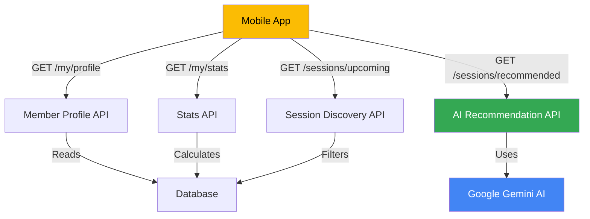

# 🌅 Good Morning! Ready for Phase 1 Implementation

**Date**: December 27, 2025
**Current Status**: Google OAuth ✅ | Backend API ✅ | Mobile App UI Ready 🎨
**Today's Goal**: Complete Phase 1 Critical APIs for mobile MVP

---

## 📋 Quick Start (3 Steps)

### Step 1: Get Your Google AI API Key (5 minutes)

1. Visit: **https://aistudio.google.com/app/apikey**
2. Click **"Create API Key"**
3. Copy the key (looks like `AIzaSyC...`)
4. Add to `.env`:
   ```bash
   nano /home/turnkey/zmos-backend/.env
   # Add this line:
   GOOGLE_AI_API_KEY="AIzaSyC_YOUR_KEY_HERE"
   # Save: Ctrl+X, Y, Enter
   ```

### Step 2: Install Gemini SDK (2 minutes)

```bash
cd /home/turnkey/zmos-backend
npm install @google/generative-ai
```

### Step 3: Test Connection (1 minute)

```bash
node test-gemini.js
```

✅ You should see: "✅ Success:" with AI response

---

## 📁 Documents Ready for You

All documentation is prepared in `/home/turnkey/zmos-backend/`:

### 1. **PHASE1_MORNING_CHECKLIST.md** ⭐ START HERE
   - Detailed step-by-step implementation guide
   - All code snippets included
   - Testing commands ready
   - **Estimated time**: 6-8 hours

### 2. **GOOGLE_GEMINI_INTEGRATION.md**
   - Complete Gemini AI integration guide
   - How it works with existing Google OAuth
   - Code examples and best practices

### 3. **MISSING_APIS_PHASE1_PHASE2.md**
   - Full list of missing APIs
   - Phase 1, 2, and 3 breakdown
   - Database schema changes needed

---

## 🎯 Today's Tasks (In Order)

### Phase 1A: Member Profile (2-3 hours)
✅ APIs to implement:
- `GET /my/profile` - View profile
- `PUT /my/profile` - Update profile
- `GET /my/stats` - Activity statistics

### Phase 1B: Session Discovery (2-3 hours)
✅ APIs to implement:
- `GET /sessions/upcoming` - Next 7 days
- `GET /sessions/today` - Today's schedule
- `GET /sessions/my-bookings` - My bookings

### Phase 1C: AI Recommendations (1-2 hours)
✅ APIs to implement:
- `GET /sessions/recommended` - AI suggestions

**Total**: ~6-8 hours

---

## 🚀 What You'll Build Today



---

## ✅ Success Criteria

Phase 1 is complete when:

1. ✅ All 8 APIs working (profile, stats, upcoming, today, my-bookings, recommended)
2. ✅ Google Gemini AI integrated and generating recommendations
3. ✅ All endpoints tested with curl/Postman
4. ✅ JWT authentication working on all endpoints
5. ✅ Mobile team can start consuming APIs

---

## 🛠️ Files You'll Create Today

**New Files** (9 total):
```
src/ai/ai.module.ts
src/ai/ai.service.ts
src/ai/dto/recommendation.dto.ts
src/moveos/services/member.service.ts
src/moveos/controllers/recommendation.controller.ts
test-gemini.js
```

**Modified Files** (4 total):
```
src/moveos/controllers/member.controller.ts
src/moveos/controllers/session.controller.ts
src/moveos/services/session.service.ts
src/moveos/moveos.module.ts
```

---

## 🧪 Testing Commands Ready

### Get JWT Token First
```bash
curl -X POST http://localhost:3000/auth/login \
  -H "Content-Type: application/json" \
  -d '{"email": "ikambili34@gmail.com", "password": "your_password"}'
```

### Test All Phase 1 APIs
```bash
# 1. Profile
curl -X GET http://localhost:3000/my/profile \
  -H "Authorization: Bearer YOUR_TOKEN"

# 2. Stats
curl -X GET http://localhost:3000/my/stats \
  -H "Authorization: Bearer YOUR_TOKEN"

# 3. Upcoming Sessions
curl -X GET "http://localhost:3000/sessions/upcoming?days=7" \
  -H "Authorization: Bearer YOUR_TOKEN"

# 4. Today's Sessions
curl -X GET http://localhost:3000/sessions/today \
  -H "Authorization: Bearer YOUR_TOKEN"

# 5. My Bookings
curl -X GET http://localhost:3000/sessions/my-bookings \
  -H "Authorization: Bearer YOUR_TOKEN"

# 6. AI Recommendations
curl -X GET http://localhost:3000/sessions/recommended \
  -H "Authorization: Bearer YOUR_TOKEN"
```

---

## 💡 Pro Tips

### Development Workflow
1. ✅ Keep `npm run start:dev` running in one terminal
2. ✅ Use another terminal for testing with curl
3. ✅ Check console logs for errors
4. ✅ Test after implementing each endpoint

### AI Integration
- ✅ Gemini is **free** (1,500 requests/day)
- ✅ Automatic fallback to rules if AI fails
- ✅ Responses are cached to save quota
- ✅ Test with `node test-gemini.js` first

### Common Issues
- **401 Unauthorized**: Check JWT token is valid
- **AI fails**: Check `.env` has `GOOGLE_AI_API_KEY`
- **Port in use**: Kill existing server with `pkill -f "npm run start:dev"`

---

## 📊 Progress Tracking

Use this to track your progress:

```
Phase 1A: Member Profile
  [ ] GET /my/profile implemented
  [ ] PUT /my/profile implemented
  [ ] GET /my/stats implemented
  [ ] All profile endpoints tested

Phase 1B: Session Discovery
  [ ] GET /sessions/upcoming implemented
  [ ] GET /sessions/today implemented
  [ ] GET /sessions/my-bookings implemented
  [ ] All discovery endpoints tested

Phase 1C: AI Recommendations
  [ ] Google Gemini SDK installed
  [ ] AI module created
  [ ] GET /sessions/recommended implemented
  [ ] AI recommendations working

Final Checks
  [ ] All 8 APIs returning 200 OK
  [ ] JWT authentication verified
  [ ] Data is tenant-isolated
  [ ] Mobile team documentation shared
```

---

## 🎉 When You're Done

After completing Phase 1:

1. ✅ **Share with Mobile Team**
   - API documentation
   - Example requests/responses
   - JWT token generation

2. ✅ **Test Integration**
   - Mobile app can call all APIs
   - Data displays correctly
   - Recommendations make sense

3. ✅ **Plan Phase 2**
   - Waitlist management
   - Notifications
   - Booking history
   - Search functionality

---

## 🆘 Need Help?

### Documentation
- `PHASE1_MORNING_CHECKLIST.md` - Detailed implementation
- `GOOGLE_GEMINI_INTEGRATION.md` - AI integration
- `MISSING_APIS_PHASE1_PHASE2.md` - Complete API list

### Google Resources
- **Get API Key**: https://aistudio.google.com/app/apikey
- **Gemini Docs**: https://ai.google.dev/docs
- **OAuth Console**: https://console.cloud.google.com

### Quick Commands
```bash
# Restart server
pkill -f "npm run start:dev" && npm run start:dev

# Test Gemini
node test-gemini.js

# Check logs
tail -f logs/combined.log
```

---

## 📈 Today's Timeline

| Time | Task | Duration |
|------|------|----------|
| 09:00 | Setup & Gemini integration | 30 min |
| 09:30 | Member Profile APIs | 2.5 hours |
| 12:00 | Lunch Break | 1 hour |
| 13:00 | Session Discovery APIs | 2.5 hours |
| 15:30 | Break | 15 min |
| 15:45 | AI Recommendations | 1.5 hours |
| 17:15 | Testing & Documentation | 45 min |
| 18:00 | **Phase 1 Complete! 🎉** | - |

---

## 🎯 Tomorrow's Preview (Phase 2)

After today's Phase 1 completion, tomorrow you'll add:
- Waitlist management
- In-app notifications
- Booking history with pagination
- Search functionality
- Member favorites

**But focus on today first!** 💪

---

## ✨ Final Checklist Before Starting

- [ ] ☕ Coffee/tea ready
- [ ] 💻 Development environment open
- [ ] 📁 All documentation files reviewed
- [ ] 🔑 Google AI API key obtained
- [ ] 🚀 Ready to code!

---

**You've got this! All the documentation, code examples, and testing commands are ready. Just follow PHASE1_MORNING_CHECKLIST.md step by step.**

**Happy coding! 🚀**

---

**Last Updated**: December 26, 2025, 00:45 AM
**Backend Status**: ✅ Running on port 3000
**Google OAuth**: ✅ Working
**Next Step**: Get Google AI API key and start Phase 1A
