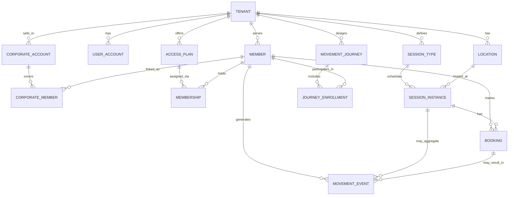

Here’s a clean **initial core ERD sketch for ZMOS** you can hand to the consultant as the “anchor model” and then evolve per feature.

---

## 1. Core Entities & Relationships (Conceptual)

### Main entities

* **Tenant**
  A movement provider org (gym group, studio brand, outdoor club).

* **Location**
  A physical or logical branch/site of a Tenant (gym branch, studio, outdoor region).

* **UserAccount**
  Login account for **staff** and **admins** at a Tenant.

* **Member**
  An end user (employee, insured person, D2C customer) **known to a Tenant**.
  Can optionally link to a ZHEP Party when integrated.

* **CorporateAccount**
  A B2B customer (employer, organisation) that buys movement access from a Tenant in ZMOS-only mode.

* **CorporateMember**
  Link between a CorporateAccount and a Member (which members of that corporate are covered).

* **AccessPlan**
  A membership/pass/pack product defined by a Tenant (monthly membership, 10-visit pass, “Metabolic Reset Plan – Movement Access”).

* **Membership**
  A specific Member’s subscription to an AccessPlan (with start/end, status, etc.).

* **SessionType**
  Template for a class/PT/event (e.g., “Morning Spin 45min – Cardio”, “Beginner Yoga”, “Bootcamp”).

* **SessionInstance**
  A scheduled occurrence of a SessionType at a specific Location and time (e.g., “Spin – 7 March 2026, 6–6:45pm at Lavington”).

* **Booking**
  A Member’s reservation for a SessionInstance.

* **MovementEvent**
  The actual **movement activity record** (check-in/attendance/Tile completion) used for streaks, adherence, and health scoring.

* **MovementJourney**
  A structured, time-bound movement program (e.g., “8-week Metabolic Reset”, “6-week Back & Core”).

* **JourneyEnrollment**
  Link between a Member and a MovementJourney, with status and progress/adherence metrics.

---

## 2. ERD Sketch (Text + Diagram)

### Relationships (in words)

* One **Tenant** has many **Locations**, **UserAccounts**, **Members**, **CorporateAccounts**, **AccessPlans**, **SessionTypes**, **MovementJourneys**.
* One **CorporateAccount** has many **CorporateMembers**; each CorporateMember links to **one Member**.
* One **Member** can have many **Memberships**; each Membership is for one **AccessPlan**.
* One **SessionType** has many **SessionInstances**, each hosted at one **Location**.
* One **Member** can make many **Bookings**; each Booking is for one **SessionInstance**.
* One **MovementEvent** belongs to:

  * one **Member**, and
  * optionally one **Booking** and/or **SessionInstance** (e.g., direct check-in).
* One **MovementJourney** has many **JourneyEnrollments**; each **Member** can be enrolled in many journeys over time.

### Mermaid-style ERD (for docs / GitHub)

*(Even if Mermaid isn’t rendered, this is a useful visual for the dev.)*

---

## 3. Suggested Key Fields per Entity (High-Level)

These are **orientation fields**, not a full schema – the consultant can flesh out columns per feature using AI-DLC.

* **Tenant**

  * `id`
  * `name`, `brand_settings`
  * `mode` (zmOS_only vs zhep_connected)
  * `created_at`, `updated_at`

* **Location**

  * `id`, `tenant_id`
  * `name`, `address`, `timezone`
  * `capacity_defaults`
  * `created_at`, `updated_at`

* **UserAccount**

  * `id`, `tenant_id`
  * `email`, `phone`
  * `role` (owner, manager, coach, front_desk, etc.)
  * `is_active`
  * `external_party_id` (nullable; link to ZHEP if integrated)

* **Member**

  * `id`, `tenant_id`
  * `name`, `email`, `phone`
  * `date_of_birth` (optional)
  * `external_party_id` (nullable; ZHEP Party reference)
  * `created_at`, `updated_at`

* **CorporateAccount**

  * `id`, `tenant_id`
  * `name`, `contact_person`, `billing_details`
  * `status`
  * `created_at`, `updated_at`

* **CorporateMember**

  * `id`, `corporate_account_id`, `member_id`
  * `status` (active, suspended, ended)
  * `started_at`, `ended_at`

* **AccessPlan**

  * `id`, `tenant_id`
  * `name`, `type` (membership, pack, corporate, etc.)
  * `billing_period` (monthly, once-off, etc.)
  * `usage_rules` (JSON: visits per period, allowed_locations, etc.)
  * `is_program_linked` (bool – linked to MovementJourney or not)
  * `created_at`, `updated_at`

* **Membership**

  * `id`, `member_id`, `access_plan_id`
  * `status` (active, paused, cancelled, expired)
  * `start_date`, `end_date`
  * `source` (direct, corporate, payer, promo)

* **SessionType**

  * `id`, `tenant_id`
  * `name`, `description`
  * `category` (class, PT, event)
  * **MPP summary fields**: `intensity`, `primary_goal`, `contraindications` (JSON)
  * `default_duration`, `default_capacity`

* **SessionInstance**

  * `id`, `session_type_id`, `location_id`
  * `start_time`, `end_time`
  * `capacity`
  * `status` (scheduled, cancelled, completed)

* **Booking**

  * `id`, `member_id`, `session_instance_id`
  * `status` (booked, checked_in, no_show, cancelled)
  * `created_at`, `cancelled_at`

* **MovementEvent**

  * `id`, `member_id`
  * `tenant_id`, `location_id` (nullable for home/remote events)
  * `session_instance_id` (nullable)
  * `booking_id` (nullable)
  * `type` (class_attendance, gym_checkin, tile_completion, outdoor_event)
  * `duration_minutes` (optional)
  * `intensity` (optional, may inherit from MPP)
  * `occurred_at`, `created_at`

* **MovementJourney**

  * `id`, `tenant_id` (tenant-owned or Zimasa-global depending on design)
  * `name`, `description`
  * `duration_weeks`
  * `target_goals` (JSON: minutes/week, sessions/week, focus areas)
  * `status` (active, archived)

* **JourneyEnrollment**

  * `id`, `movement_journey_id`, `member_id`
  * `start_date`, `end_date`
  * `status` (active, paused, completed, dropped)
  * `adherence_score` (cached, can also be computed from MovementEvents)
  * `last_evaluated_at`

---

## 4. Notes for the Consultant

You can add this as a small footer in your doc:

* This ERD is the **core conceptual anchor** for ZMOS.
* We will:

  * Keep these entities and names stable where possible.
  * Evolve attributes and add secondary entities **per feature** using the AI-DLC process.
* Integration with ZHEP:

  * Is done via `external_party_id` and **service interfaces** (IdentityService, EligibilityService, etc.), not by adding ZHEP tables here.

If you want, I can next help you turn this into a **`docs/data-model-core.md`** file with a short intro plus this ERD, ready to drop into the repo.
