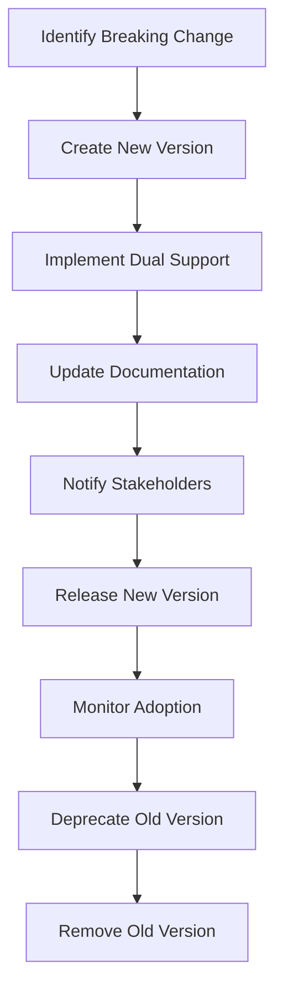

# ZMOS API Versioning Policy

This document outlines the versioning strategy, deprecation policies, and breaking change management for the ZMOS API. Proper versioning ensures backward compatibility and smooth client updates.

## Current API Version

### Active Version
- **Version**: v1 (implicit in endpoints)
- **Status**: Active, fully supported
- **Released**: Initial release
- **Sunset Date**: None scheduled

### Version Format
```
Major.Minor.Patch
- Major: Breaking changes
- Minor: New features (backward compatible)
- Patch: Bug fixes (backward compatible)
```

## Versioning Strategy

### URL Path Versioning
```http
# Current approach (implicit v1)
GET /sessions
GET /bookings
GET /locations

# Future explicit versioning (if needed)
GET /v2/sessions
GET /v2/bookings
GET /v2/locations
```

### Header-Based Versioning
```http
# Preferred approach for future versions
GET /sessions
Accept: application/vnd.zmos.v2+json
X-API-Version: 2.1.0

# Response
Content-Type: application/vnd.zmos.v2+json
X-API-Version: 2.1.0
```

### Content Negotiation
```javascript
// Client request with version preference
const headers = {
  'Accept': 'application/vnd.zmos.v2+json',
  'X-API-Version': '2.0.0'
};

// Server response
{
  "version": "2.0.0",
  "data": { ... },
  "links": {
    "self": "/sessions",
    "deprecated": "/v1/sessions"
  }
}
```

## Deprecation Policy

### Deprecation Timeline
```
Day 0:    Feature announced, old version marked deprecated
Day 30:   Warning headers added to deprecated endpoints
Day 60:   Documentation updated, migration guides published
Day 90:   Final warning, preparation for removal
Day 180:  Deprecated version removed
```

### Deprecation Headers
```http
# Deprecation warning
Deprecation: true
Link: </v2/sessions>; rel="successor-version"
X-Deprecation-Reason: "Improved pagination and filtering"

# Sunset warning (30 days before removal)
Sunset: Wed, 21 Oct 2025 07:28:00 GMT
Link: </migration-guide>; rel="help"
```

### Client Handling
```kotlin
// Android - Handle deprecation warnings
class DeprecationInterceptor : Interceptor {
    override fun intercept(chain: Chain): Response {
        val response = chain.proceed(chain.request())

        if (response.header("Deprecation") == "true") {
            val reason = response.header("X-Deprecation-Reason")
            // Log warning and notify user to update app
            showDeprecationWarning(reason)
        }

        return response
    }
}
```

## Breaking Change Management

### Breaking Change Definition
Breaking changes include:
- Removing or renaming endpoints
- Changing request/response formats
- Removing or changing required fields
- Changing authentication requirements
- Modifying error response formats
- Changing pagination behavior

### Breaking Change Process


### Dual Version Support
```javascript
// Server-side dual version support
app.get('/sessions', (req, res) => {
  const requestedVersion = getRequestedVersion(req);

  if (requestedVersion === 'v2') {
    // New v2 logic
    return res.json(formatV2Response(data));
  } else {
    // Legacy v1 logic
    return res.json(formatV1Response(data));
  }
});
```

## Change Classification

### Non-Breaking Changes (Minor/Patch)
- ✅ Adding new optional fields
- ✅ Adding new endpoints
- ✅ Changing response field order
- ✅ Adding new error codes
- ✅ Improving performance
- ✅ Fixing bugs without behavior change

### Breaking Changes (Major)
- ❌ Removing endpoints
- ❌ Renaming fields
- ❌ Changing field types
- ❌ Making optional fields required
- ❌ Changing authentication flow
- ❌ Modifying pagination limits

### Examples
```javascript
// ✅ Non-breaking: Add optional field
{
  "id": "session-123",
  "name": "HIIT Class",
  "instructor": "Sarah"  // New optional field
}

// ❌ Breaking: Remove required field
{
  "id": "session-123",
  "name": "HIIT Class"
  // Missing required "startTime" field
}

// ✅ Non-breaking: Add endpoint
POST /sessions/{id}/favorite

// ❌ Breaking: Change URL structure
GET /classes/{id}  // Was /sessions/{id}
```

## Version History

### Version 1.0.0 (Current)
**Released**: December 2025
**Features**:
- Basic CRUD operations for sessions, bookings, locations
- JWT authentication
- Multi-tenant support
- Basic pagination

**Known Issues**: None
**Support**: Full support until deprecated

### Planned Version 2.0.0
**Target Release**: Q2 2026
**Breaking Changes**:
- Enhanced pagination with cursor-based navigation
- Unified error response format
- Improved filtering capabilities
- GraphQL support (optional)

**Migration Guide**: [Link to migration documentation]

## Client Version Compatibility

### Mobile App Version Matrix
```
API Version | Android App | iOS App | Web App
------------|-------------|---------|---------
v1.0.x      | 1.0.0+      | 1.0.0+  | 1.0.0+
v2.0.x      | 2.0.0+      | 2.0.0+  | 2.0.0+
```

### Version Detection
```kotlin
// Android - Check API version support
suspend fun checkApiCompatibility(): ApiCompatibility {
    try {
        val response = apiService.getApiVersion()

        return when {
            response.version.startsWith("2.") -> ApiCompatibility.SUPPORTED
            response.version.startsWith("1.") -> ApiCompatibility.LEGACY
            else -> ApiCompatibility.UNSUPPORTED
        }
    } catch (e: Exception) {
        return ApiCompatibility.UNKNOWN
    }
}
```

### Graceful Degradation
```kotlin
// Fallback to legacy API if new version unavailable
suspend fun getSessions(filter: SessionFilter): List<SessionInstance> {
    return try {
        // Try new API first
        apiService.getSessionsV2(filter)
    } catch (e: HttpException) {
        if (e.code() == 404) {
            // Fallback to v1 API
            apiService.getSessionsV1(filter.toLegacyFormat())
        } else {
            throw e
        }
    }
}
```

## Migration Strategy

### Zero-Downtime Migration
```javascript
// Blue-green deployment approach
const express = require('express');
const v1Routes = require('./routes/v1');
const v2Routes = require('./routes/v2');

const app = express();

// Mount both versions
app.use('/api/v1', v1Routes);
app.use('/api/v2', v2Routes);

// Default to latest version
app.use('/api', v2Routes);

// Health check
app.get('/health', (req, res) => {
  res.json({
    status: 'healthy',
    versions: {
      v1: 'active',
      v2: 'active'
    }
  });
});
```

### Database Migration
```sql
-- Safe migration with rollback capability
BEGIN;

-- Create new tables
CREATE TABLE sessions_v2 (...);

-- Migrate data
INSERT INTO sessions_v2 SELECT * FROM sessions;

-- Validate migration
SELECT COUNT(*) FROM sessions_v2;
-- Should match: SELECT COUNT(*) FROM sessions;

-- Update application to use new tables
-- (Application deployment happens here)

-- Drop old tables after successful deployment
DROP TABLE sessions;

COMMIT;
```

### Rollback Strategy
```bash
# Rollback script
#!/bin/bash

echo "Rolling back API to v1..."

# Stop v2 traffic
kubectl scale deployment api-v2 --replicas=0

# Scale up v1
kubectl scale deployment api-v1 --replicas=10

# Rollback database
psql -c "BEGIN; DROP TABLE sessions_v2; ALTER TABLE sessions_backup RENAME TO sessions; COMMIT;"

echo "Rollback complete. API v1 is active."
```

## Communication Strategy

### Stakeholder Notifications
- **Email**: Version release announcements
- **Changelog**: Detailed change documentation
- **Webhooks**: Automated notifications for API consumers
- **Status Page**: Real-time API status and version information

### Developer Resources
```markdown
# Migration Guide: v1 → v2

## What's Changed

### 1. Pagination
**Before (v1):**
```json
{
  "data": [...],
  "page": 1,
  "totalPages": 5
}
```

**After (v2):**
```json
{
  "data": [...],
  "cursor": "eyJwYWdlIjoxfQ==",
  "hasNext": true
}
```

### 2. Error Format
**Before (v1):**
```json
{
  "error": "Session not found"
}
```

**After (v2):**
```json
{
  "error": {
    "code": "SESSION_NOT_FOUND",
    "message": "The requested session could not be found",
    "details": { "sessionId": "123" }
  }
}
```

## Code Examples

### Pagination Migration
```kotlin
// v1 pagination
suspend fun getSessionsV1(page: Int = 1): SessionResponse {
    return apiService.getSessions(page = page)
}

// v2 cursor-based pagination
suspend fun getSessionsV2(cursor: String? = null): SessionResponse {
    return apiService.getSessions(cursor = cursor)
}

// Migration helper
fun migratePagination(v1Response: V1Response): V2Response {
    return V2Response(
        data = v1Response.data,
        cursor = base64Encode("{\"page\":${v1Response.page}}"),
        hasNext = v1Response.page < v1Response.totalPages
    )
}
```

## Testing Strategy

### Version Compatibility Testing
```javascript
describe('API Version Compatibility', () => {
  it('should support both v1 and v2 responses', async () => {
    // Test v1
    const v1Response = await request(app)
      .get('/sessions')
      .set('Accept', 'application/json');

    expect(v1Response.body).toHaveProperty('data');

    // Test v2
    const v2Response = await request(app)
      .get('/sessions')
      .set('Accept', 'application/vnd.zmos.v2+json');

    expect(v2Response.body).toHaveProperty('data');
    expect(v2Response.body).toHaveProperty('cursor');
  });
});
```

### Breaking Change Detection
```bash
# Automated breaking change detection
npx @apidevtools/swagger-diff api-v1.yaml api-v2.yaml

# Output:
# Breaking changes detected:
# - Removed field: sessions[].instructor (optional)
# - Changed type: pagination.page (string → number)
```

## Support & Maintenance

### Version Support Timeline
```
┌─────────────┬──────────────┬──────────────┬──────────────┐
│ Version     │ Released     │ Deprecated   │ End Support  │
├─────────────┼──────────────┼──────────────┼──────────────┤
│ v1.0.x      │ Dec 2025     │ Jun 2027     │ Dec 2027     │
│ v2.0.x      │ Jun 2026     │ Dec 2028     │ Jun 2029     │
│ v3.0.x      │ Dec 2027     │ Jun 2030     │ Dec 2030     │
└─────────────┴──────────────┴──────────────┴──────────────┘
```

### Support Levels
- **Active**: Full support, new features, bug fixes
- **Maintenance**: Critical bug fixes only
- **Deprecated**: No new features, security fixes only
- **End of Life**: No support, security risk

### Contact Information
- **API Support**: api-support@zmos.com
- **Version Announcements**: Subscribe to API changelog
- **Migration Help**: migration-guides.zmos.com

---

## Summary

- **Current**: v1.0.0 (fully supported)
- **Strategy**: Header-based versioning for future compatibility
- **Breaking Changes**: Major version bumps only
- **Deprecation**: 180-day notice period
- **Migration**: Zero-downtime with rollback capability
- **Support**: 2-year lifecycle per version

This versioning strategy ensures smooth evolution while maintaining backward compatibility for mobile and web clients.

---

*Last Updated: December 2025*
*Next Review: June 2026*
