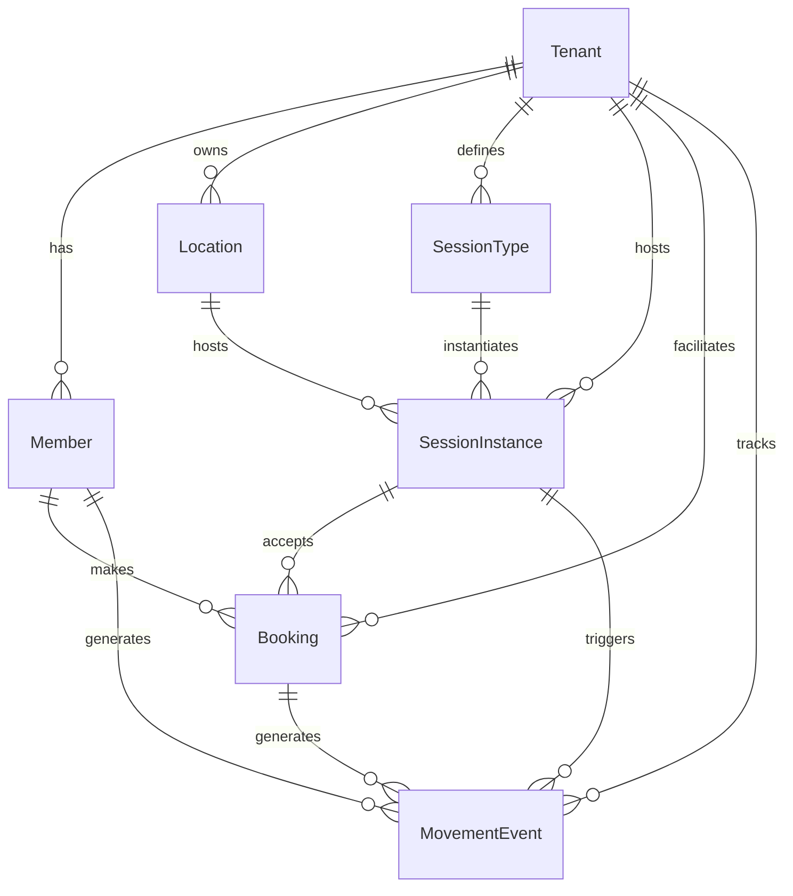

# AI-DLC Design Note: MoveOS Core ERD Elaboration

**AI-DLC Phase**: Elaboration
**Status**: Approved for Implementation
**Date**: December 2025
**Prepared by**: AI Assistant (Cursor)

**Reference Documents:**
- `docs/Zimasa MotionOS (ZMOS) – AI-DLC Working Agreement.md`
- `docs/IMPLEMENTATION_PLAN.md` (Phase 2: MoveOS Walking Skeleton)
- `docs/MoveOS_User_Journeys.md`
- `docs/ANDROID_API_COMPATIBILITY.md`

---

## 🎯 **Problem Framing** (AI-DLC Step 1)

### **Business Context**
ZMOS MoveOS is the core movement domain module providing foundational movement tracking, scheduling, and engagement functionality. It serves movement providers (gyms/studios) and members (users) in a multi-tenant SaaS environment, focusing on **movement as health engagement** rather than generic gym operations.

### **Walking Skeleton Scope**
**End-to-End Flow**: `Tenant → Location → SessionType → SessionInstance → Booking → MovementEvent → Simple Streak`

**Key User Stories (Phase 2):**
- **US-001**: Provider sets up gym profile with locations
- **US-002**: Provider creates and manages class schedules
- **US-003**: Provider defines different class types and capacities
- **US-011**: Member browses and books available classes
- **US-012**: Member receives instant booking confirmation
- **US-016**: Member checks in to attended classes
- **US-017**: Member tracks attendance streak

### **Success Criteria**
- Providers can create locations, define session types, schedule sessions
- Members can register, book sessions, check in, and view streaks
- All operations respect tenant isolation
- End-to-end flow works for single tenant
- Foundation for Phase 3 (PulseLoop) and Phase 4 (CarePath Move)

---

## 🏗️ **Core ERD Design** (AI-DLC Step 2)

### **Entity Relationship Diagram**



### **Detailed Table Structures**

#### **1. Location Entity**
**Purpose**: Represents physical facilities where movement sessions occur
```prisma
model Location {
  id        String   @id @default(uuid()) @db.Uuid
  tenantId  String   @db.Uuid
  name      String   // Display name (e.g., "Main Studio", "Downtown Location")
  address   String?  // Full address for maps/navigation
  capacity  Int?     // Maximum concurrent participants
  timezone  String   @default("UTC") // For scheduling across timezones
  isActive  Boolean  @default(true)  // Soft delete alternative
  createdAt DateTime @default(now())
  updatedAt DateTime @updatedAt

  // Relations
  tenant           Tenant           @relation(fields: [tenantId], references: [id], onDelete: Cascade)
  sessionInstances SessionInstance[]

  // Indexes
  @@index([tenantId])
  @@index([isActive])
  @@unique([tenantId, name]) // Prevent duplicate names within tenant
}
```

#### **2. SessionType Entity**
**Purpose**: Reusable templates for movement session types
```prisma
model SessionType {
  id          String @id @default(uuid()) @db.Uuid
  tenantId    String @db.Uuid
  name        String // Display name (e.g., "HIIT Class", "Yoga Flow")
  description String? // Detailed description for members
  durationMin Int    // Session duration in minutes
  category    String // 'class', 'pt', 'group', 'workshop'
  maxCapacity Int?   // Default capacity (can be overridden per instance)
  difficulty  String @default("intermediate") // 'beginner', 'intermediate', 'advanced'
  isActive    Boolean @default(true)
  createdAt   DateTime @default(now())
  updatedAt   DateTime @updatedAt

  // Relations
  tenant           Tenant           @relation(fields: [tenantId], references: [id], onDelete: Cascade)
  sessionInstances SessionInstance[]

  // Indexes
  @@index([tenantId])
  @@index([category])
  @@index([isActive])
  @@unique([tenantId, name])
}
```

#### **3. SessionInstance Entity**
**Purpose**: Scheduled occurrences of session types at specific locations
```prisma
model SessionInstance {
  id            String   @id @default(uuid()) @db.Uuid
  tenantId      String   @db.Uuid
  sessionTypeId String   @db.Uuid
  locationId    String   @db.Uuid
  startTime     DateTime // When session begins
  endTime       DateTime // When session ends (calculated or explicit)
  capacity      Int?     // Override SessionType capacity
  status        String   @default("scheduled") // 'scheduled', 'cancelled', 'completed'
  instructor    String?  // Instructor name (future: link to staff entity)
  notes         String?  // Special instructions or changes
  createdAt     DateTime @default(now())
  updatedAt     DateTime @updatedAt

  // Relations
  tenant      Tenant     @relation(fields: [tenantId], references: [id], onDelete: Cascade)
  sessionType SessionType @relation(fields: [sessionTypeId], references: [id], onDelete: Cascade)
  location    Location   @relation(fields: [locationId], references: [id], onDelete: Cascade)
  bookings    Booking[]

  // Indexes
  @@index([tenantId])
  @@index([startTime])
  @@index([status])
  @@index([sessionTypeId])
  @@index([locationId])
  @@unique([locationId, startTime]) // Prevent double-booking locations
}
```

#### **4. Booking Entity**
**Purpose**: Member reservations for session instances
```prisma
model Booking {
  id               String   @id @default(uuid()) @db.Uuid
  tenantId         String   @db.Uuid
  memberId         String   @db.Uuid
  sessionInstanceId String  @db.Uuid
  status           String   @default("confirmed") // 'confirmed', 'cancelled', 'no_show', 'attended'
  bookedAt         DateTime @default(now()) // When booking was made
  attendedAt       DateTime? // When member checked in
  cancelledAt      DateTime? // When booking was cancelled
  notes            String?  // Special requests or notes
  createdAt        DateTime @default(now())
  updatedAt        DateTime @updatedAt

  // Relations
  tenant          Tenant          @relation(fields: [tenantId], references: [id], onDelete: Cascade)
  member          Member          @relation(fields: [memberId], references: [id], onDelete: Cascade)
  sessionInstance SessionInstance @relation(fields: [sessionInstanceId], references: [id], onDelete: Cascade)

  // Indexes
  @@index([tenantId])
  @@index([memberId])
  @@index([sessionInstanceId])
  @@index([status])
  @@index([bookedAt])
  @@unique([memberId, sessionInstanceId]) // Prevent double-booking
}
```

#### **5. MovementEvent Entity**
**Purpose**: Tracks all movement-related activities and achievements
```prisma
model MovementEvent {
  id               String   @id @default(uuid()) @db.Uuid
  tenantId         String   @db.Uuid
  memberId         String   @db.Uuid
  sessionInstanceId String? @db.Uuid
  type             String   // Event type classification
  metadata         Json?    // Flexible event data
  createdAt        DateTime @default(now())

  // Relations
  tenant          Tenant          @relation(fields: [tenantId], references: [id], onDelete: Cascade)
  member          Member          @relation(fields: [memberId], references: [id], onDelete: Cascade)
  sessionInstance SessionInstance? @relation(fields: [sessionInstanceId], references: [id])

  // Indexes
  @@index([tenantId])
  @@index([memberId])
  @@index([createdAt])
  @@index([type])
  @@index([sessionInstanceId])
}
```

---

## 🔌 **API Endpoint Specifications**

### **Provider APIs (US-001, US-002, US-003)**

#### **Locations Management**
```http
# Create location
POST /locations
{
  "name": "Main Studio",
  "address": "123 Fitness St, City, ST 12345",
  "capacity": 20,
  "timezone": "America/New_York"
}

# List locations
GET /locations

# Update location
PUT /locations/{id}

# Deactivate location
DELETE /locations/{id}
```

#### **Session Types Management**
```http
# Create session type
POST /session-types
{
  "name": "HIIT Class",
  "description": "High-intensity interval training",
  "durationMin": 45,
  "category": "class",
  "maxCapacity": 15,
  "difficulty": "intermediate"
}

# List session types
GET /session-types
```

#### **Session Scheduling**
```http
# Create session instance
POST /sessions
{
  "sessionTypeId": "uuid",
  "locationId": "uuid",
  "startTime": "2025-12-19T10:00:00Z",
  "capacity": 12,
  "instructor": "Sarah Johnson",
  "notes": "Bring water bottle"
}

# List sessions
GET /sessions?date=2025-12-19&status=scheduled
```

### **Member APIs (US-011, US-012, US-016)**

#### **Session Browsing & Booking**
```http
# Browse available sessions
GET /sessions/available?date=2025-12-19&category=class

# Book a session
POST /bookings
{
  "sessionInstanceId": "uuid",
  "notes": "First time attending"
}

# View bookings
GET /my/bookings?status=confirmed
```

#### **Check-in & Attendance**
```http
# Check in to session
POST /sessions/{id}/checkin

# View attendance history
GET /my/attendance?start=2025-12-01&end=2025-12-31

# View current streak
GET /my/streak
```

---

## ⚡ **Business Logic & Rules**

### **Capacity Management**
```typescript
// Before creating booking
const session = await getSessionInstance(sessionId);
const currentBookings = await countConfirmedBookings(sessionId);
if (currentBookings >= session.capacity) {
  throw new BadRequestException('Session is full');
}
```

### **Streak Calculation**
```typescript
function calculateStreak(memberId: string): number {
  const events = await getMovementEvents(memberId, {
    type: 'class_attendance',
    orderBy: { createdAt: 'desc' }
  });

  let streak = 0;
  let currentDate = new Date();

  for (const event of events) {
    const eventDate = event.createdAt.toDateString();
    const expectedDate = currentDate.toDateString();

    if (eventDate === expectedDate) {
      streak++;
      currentDate.setDate(currentDate.getDate() - 1);
    } else if (eventDate < expectedDate) {
      break; // Gap in attendance
    }
  }

  return streak;
}
```

---

## 🎯 **Implementation Plan**

### **Phase 1: Database & Models**
- [ ] Create Prisma migrations for all entities
- [ ] Update Prisma client extensions for tenant filtering
- [ ] Add database indexes and constraints

### **Phase 2: Core Services**
- [ ] Implement LocationService, SessionTypeService, etc.
- [ ] Create business logic for capacity and validation
- [ ] Implement streak calculation service

### **Phase 3: API Controllers**
- [ ] Create REST endpoints for all entities
- [ ] Add comprehensive input validation
- [ ] Implement error handling

### **Phase 4: Testing & Validation**
- [ ] Write unit and integration tests
- [ ] Create E2E walking skeleton tests
- [ ] Performance and security validation

---

## ✅ **Design Note Approval Status**

**Status**: ✅ **APPROVED FOR IMPLEMENTATION**

**Approval Checklist:**
- [x] Entity relationships are correct and normalized
- [x] Database indexes support query patterns
- [x] API endpoints follow REST conventions
- [x] Business rules are clearly defined
- [x] Error handling covers edge cases
- [x] Android compatibility is considered
- [x] AI-DLC process has been followed

**Next Step**: Begin Phase 2 implementation with database models

**Approved by**: Development Team (Following AI-DLC Process)
**Date**: December 2025